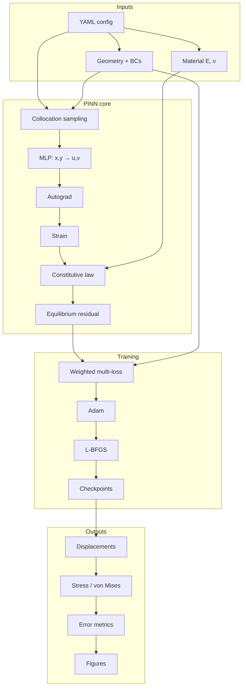
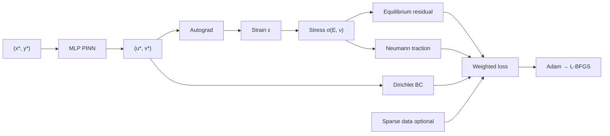

# Physics-Informed Neural Network for 2D Solid Mechanics

A production-quality **Scientific Machine Learning** portfolio project that solves **2D linear elasticity** with a Physics-Informed Neural Network (PINN), validates the solver with a manufactured solution, compares against an analytical Timoshenko cantilever reference, and supports **inverse estimation of Young's modulus** from sparse displacement data.

| Capability | Status |
|---|---|
| Forward PINN (plane stress / plane strain) | Implemented |
| Soft & hard Dirichlet BC enforcement | Implemented |
| Neumann / traction BCs (uniform & parabolic) | Implemented |
| PyTorch automatic differentiation (no FD for PDEs) | Implemented |
| Adam → L-BFGS two-stage training | Implemented |
| Non-dimensional scaling | Implemented |
| Manufactured-solution verification | Implemented |
| Inverse estimation of Young's modulus \(E\) | Implemented |
| Metrics, Matplotlib visualization, YAML configs | Implemented |
| pytest / ruff / mypy | Implemented |

---

## Table of contents

1. [Overview](#overview)
2. [Physical problem](#physical-problem)
3. [Governing equations](#governing-equations)
4. [PINN formulation](#pinn-formulation)
5. [Boundary conditions](#boundary-conditions)
6. [Scaling and non-dimensionalization](#scaling-and-non-dimensionalization)
7. [Collocation sampling](#collocation-sampling)
8. [Training strategy](#training-strategy)
9. [Reference solutions](#reference-solutions)
10. [Evaluation and visualization](#evaluation-and-visualization)
11. [Inverse problem](#inverse-problem)
12. [Project structure](#project-structure)
13. [Installation](#installation)
14. [Quick start](#quick-start)
15. [Configuration guide](#configuration-guide)
16. [Example results](#example-results)
17. [Testing and quality](#testing-and-quality)
18. [Limitations](#limitations)
19. [Next improvements](#next-improvements)
20. [License](#license)

---

## Overview

Classical FEM solves linear elasticity by discretizing the weak form on a mesh. A PINN instead represents the displacement field with a neural network

\[
(u,v) = \mathcal{N}_\theta(x,y)
\]

and minimizes a loss that penalizes:

- equilibrium PDE residuals in the domain,
- Dirichlet / Neumann boundary residuals,
- optional sparse measurement mismatch (data / inverse mode).

**Why this project is useful as a portfolio piece**

- Couples solid mechanics with modern ML engineering
- Uses automatic differentiation for strain, stress, and equilibrium
- Separates physics modules from training loops
- Includes reproducible YAML configs, checkpoints, tests, and honest metrics



---

## Physical problem

### Default application: cantilever plate

Rectangular domain

\[
\Omega = [0, L] \times [0, H]
\]

with default geometry \(L = 1\), \(H = 0.2\).

| Boundary | Condition |
|---|---|
| Left \(x=0\) | Fixed: \(u = 0\), \(v = 0\) |
| Right \(x=L\) | Tip shear traction (uniform or Timoshenko **parabolic**) |
| Top / bottom | Traction-free |

**Assumptions**

- Small deformation / infinitesimal strain
- Homogeneous isotropic linear elasticity
- Quasi-static loading (no inertia)
- **Plane stress** by default; **plane strain** selectable in YAML

**Material (consistent unit system)**

Default cantilever config uses

- \(E = 210000\)
- \(\nu = 0.3\)

Interpret these consistently (for example lengths in mm and \(E\) in MPa). Do **not** mix unit systems inside one run.

### Verification problem: manufactured solution

A quadratic displacement field

\[
u = A x^2 + B y^2,\qquad
v = C x^2 + D y^2
\]

is used with an analytically derived body force so that the PDE residual of the exact field is zero. This is the strongest numerical check of the AD / constitutive / equilibrium pipeline.

---

## Governing equations

### Equilibrium

\[
\frac{\partial \sigma_{xx}}{\partial x}
+ \frac{\partial \sigma_{xy}}{\partial y}
+ f_x = 0
\]

\[
\frac{\partial \sigma_{xy}}{\partial x}
+ \frac{\partial \sigma_{yy}}{\partial y}
+ f_y = 0
\]

### Kinematics (infinitesimal strain)

\[
\varepsilon_{xx} = \frac{\partial u}{\partial x},\qquad
\varepsilon_{yy} = \frac{\partial v}{\partial y},\qquad
\gamma_{xy} = \frac{\partial u}{\partial y} + \frac{\partial v}{\partial x}
\]

### Constitutive law — plane stress

\[
\sigma_{xx} = \frac{E}{1-\nu^2}(\varepsilon_{xx}+\nu\varepsilon_{yy})
\]

\[
\sigma_{yy} = \frac{E}{1-\nu^2}(\varepsilon_{yy}+\nu\varepsilon_{xx})
\]

\[
\sigma_{xy} = \frac{E}{2(1+\nu)}\gamma_{xy}
\]

### Constitutive law — plane strain

Using Lamé parameters

\[
\mu = \frac{E}{2(1+\nu)},\qquad
\lambda = \frac{E\nu}{(1+\nu)(1-2\nu)}
\]

\[
\sigma_{xx} = (\lambda+2\mu)\varepsilon_{xx} + \lambda\varepsilon_{yy}
\]

\[
\sigma_{yy} = (\lambda+2\mu)\varepsilon_{yy} + \lambda\varepsilon_{xx}
\]

\[
\sigma_{xy} = \mu\gamma_{xy}
\]

### von Mises stress

**Plane stress**

\[
\sigma_{\mathrm{vm}}
=
\sqrt{
\sigma_{xx}^2
- \sigma_{xx}\sigma_{yy}
+ \sigma_{yy}^2
+ 3\sigma_{xy}^2
}
\]

**Plane strain** uses \(\sigma_{zz}=\nu(\sigma_{xx}+\sigma_{yy})\) in the full equivalent-stress expression.

All physics lives under `src/pinn_elasticity/physics/` and is **not** hard-coded inside the training loop.

---

## PINN formulation

### Network

| Item | Default |
|---|---|
| Input | \((x^*, y^*)\) |
| Output | \((u^*, v^*)\) |
| Architecture | `2 → 64 → 64 → 64 → 64 → 2` |
| Activation | `tanh` (also `sine`, `swish`) |
| Initialization | Xavier normal, zero biases |

### Automatic differentiation path

```text
(x, y) → NN → (u, v)
              ↓ autograd
         displacement gradients
              ↓
         strain ε
              ↓ constitutive
         stress σ
              ↓ autograd
         div(σ) + f  = residual
```

Finite differences are **not** used for PDE derivatives.

### Loss function

\[
\mathcal{L}
=
\lambda_{\mathrm{pde}} \mathcal{L}_{\mathrm{pde}}
+ \lambda_{\mathrm{bc}} \mathcal{L}_{\mathrm{bc}}
+ \lambda_{\mathrm{data}} \mathcal{L}_{\mathrm{data}}
\]

where

- \(\mathcal{L}_{\mathrm{pde}}\): mean squared equilibrium residual
- \(\mathcal{L}_{\mathrm{bc}}\): Dirichlet + Neumann MSE (with separate inner weights)
- \(\mathcal{L}_{\mathrm{data}}\): optional sparse displacement MSE



---

## Boundary conditions

### Supported types

| Type | Description |
|---|---|
| Fixed displacement | \(u=v=0\) |
| Prescribed displacement | Arbitrary \(u,v\) targets |
| Full traction | Prescribed \((t_x, t_y)\) |
| Traction-free | \(t_x=t_y=0\) |
| Parabolic tip shear | Timoshenko-consistent end shear profile |

### Soft vs hard Dirichlet

| Mode | Config | Behavior |
|---|---|---|
| **Soft** | `boundary.enforcement: soft` | Penalty MSE on boundary displacements |
| **Hard** | `boundary.enforcement: hard` | Output transform \(u = x\,\hat{u}\), \(v = x\,\hat{v}\) so the left edge is exactly zero |

Hard Dirichlet removes the need for a left-edge displacement penalty. Neumann conditions remain soft in both modes.

### Tip traction profiles

- `uniform`: constant \((t_x, t_y)\) on the right edge
- `parabolic`: Timoshenko end-shear

\[
t_y(y) = \frac{P}{2I}\bigl(c^2 - (y-c)^2\bigr),\quad
P = t_y^{\mathrm{nominal}} H,\quad
I = H^3/12,\quad
c = H/2
\]

Use `parabolic` when comparing against the analytical beam reference.

---

## Scaling and non-dimensionalization

Large \(E\) makes physical displacements tiny and harms optimization. The network therefore operates in scaled variables:

\[
x^* = \frac{x}{L_{\mathrm{ref}}},\qquad
u^* = \frac{u}{U_{\mathrm{ref}}}
\]

Default cantilever bending scale:

\[
U_{\mathrm{ref}} \sim \frac{|t|\, L^3}{E H^2}
\]

Physical strain from network gradients:

\[
\varepsilon_{\mathrm{phys}}
=
\frac{U_{\mathrm{ref}}}{L_{\mathrm{ref}}}
\frac{\partial u^*}{\partial x^*}
\]

Stress is evaluated with the **physical** constitutive law. Traction BCs stay in physical units. Equilibrium is assembled consistently with

\[
\nabla_x = \frac{1}{L_{\mathrm{ref}}}\nabla_*.
\]

See `src/pinn_elasticity/scaling.py`.

---

## Collocation sampling

| Set | Role |
|---|---|
| Interior points | PDE residual |
| Boundary points | Dirichlet / Neumann losses |
| Evaluation grid | Metrics and plots |

Sampling methods:

- `uniform` random
- `lhs` Latin Hypercube Sampling (default)

Optional residual-based adaptive refinement:

1. Train for a while
2. Evaluate PDE residual magnitude
3. Add points near high-residual regions
4. Continue training

Enable with `adaptive_sampling.enabled: true`.

---

## Training strategy

### Two-stage optimization

1. **Adam** — global exploration
   - learning-rate schedulers: `none` | `cosine` | `step`
   - gradient clipping
   - checkpointing / early stopping
2. **L-BFGS** — local refinement
   - strong Wolfe line search

### Logging

Structured logs include epoch, total / PDE / BC / data losses, learning rate, and wall time. Optional MLflow backend:

```yaml
logging:
  backend: mlflow   # none | mlflow | tensorboard
```

### Checkpoints

Typical outputs per run:

```text
outputs/<run_name>/
  best.pt
  last.pt
  config.yaml
  metrics.json
  metrics_table.md
  figures/
```

---

## Reference solutions

| Source | When to use |
|---|---|
| Manufactured field | Strong AD / PDE correctness check |
| Timoshenko analytical beam | Cantilever displacement / stress comparison |
| CSV (`x,y,u,v[,σ…]`) | Precomputed FEM or external data |

FEniCSx is **not** required to run the PINN.

Generate an analytical CSV:

```bash
python scripts/generate_reference.py --config configs/cantilever.yaml
```

**Note.** The classical Timoshenko closed-form stress field is an approximation to full 2D elasticity. Displacement-derived Hooke stresses from the same analytical \(u,v\) are the constitutive-consistent comparison for some checks.

---

## Evaluation and visualization

### Metrics (per field)

- Relative \(L^2\) error
- MAE
- RMSE
- Max absolute error

Reported for \(u\), \(v\), \(\sigma_{xx}\), \(\sigma_{yy}\), \(\sigma_{xy}\), and von Mises.

### Figures (Matplotlib only)

- Displacement contours \(u\), \(v\), magnitude
- Stress contours \(\sigma_{xx}\), \(\sigma_{yy}\), \(\sigma_{xy}\)
- von Mises stress
- PDE residual map
- Deformed geometry
- Training loss history

---

## Inverse problem

Goal: estimate unknown material parameters from sparse measurements

```text
x, y, u, v
```

### Trainable parameterization (physically safe)

| Parameter | Transform | Constraint |
|---|---|---|
| \(E\) | softplus | \(E > 0\) |
| \(\nu\) | scaled sigmoid | \(0 < \nu < 0.5\) |

Example YAML:

```yaml
inverse:
  enabled: true
  learn_E: true
  learn_nu: false
  E_init: 0.4
  noise_std: 0.01
  n_measurements: 60
```

The optimizer jointly updates network weights and unknown physics parameters.

---

## Project structure

```text
PINN for 2D Solid Mechanics/
├── README.md
├── pyproject.toml
├── .gitignore
├── configs/
│   ├── cantilever.yaml              # full cantilever forward
│   ├── smoke.yaml                   # fast CI / smoke run
│   ├── demo.yaml                    # shorter cantilever demo
│   ├── inverse.yaml                 # cantilever inverse
│   ├── manufactured.yaml            # manufactured forward
│   └── manufactured_inverse.yaml    # manufactured inverse
├── scripts/
│   ├── train_forward.py
│   ├── train_inverse.py
│   ├── train_manufactured.py
│   ├── train_manufactured_inverse.py
│   ├── evaluate.py
│   └── generate_reference.py
├── src/pinn_elasticity/
│   ├── config.py
│   ├── geometry.py
│   ├── sampling.py
│   ├── scaling.py
│   ├── pipeline.py
│   ├── physics/
│   │   ├── kinematics.py
│   │   ├── constitutive.py
│   │   ├── equilibrium.py
│   │   └── stress.py
│   ├── models/pinn.py
│   ├── boundary/
│   │   ├── conditions.py
│   │   └── losses.py
│   ├── training/
│   │   ├── trainer.py
│   │   ├── losses.py
│   │   └── checkpointing.py
│   ├── inverse/parameters.py
│   ├── evaluation/
│   │   ├── metrics.py
│   │   ├── reference.py
│   │   ├── predict.py
│   │   └── manufactured.py
│   └── visualization/plots.py
├── tests/
├── data/reference/
└── outputs/
```

---

## Installation

Requires **Python ≥ 3.10** (3.11+ preferred).

```bash
cd "PINN for 2D Solid Mechanics"

python -m venv .venv

# Git Bash / Linux / macOS
source .venv/Scripts/activate      # Windows Git Bash
# source .venv/bin/activate        # Linux / macOS
# .venv\Scripts\Activate.ps1       # PowerShell

python -m pip install -U pip setuptools wheel

# CPU Torch (recommended on Windows if CUDA wheels are awkward)
pip install torch --index-url https://download.pytorch.org/whl/cpu

pip install -e ".[dev]"

# Optional experiment tracking
pip install -e ".[dev,mlflow]"
```

If a global/system PyTorch install is broken (common with Windows long-path limits), always use the project `.venv`.

---

## Quick start

### 1. Recommended verification (manufactured forward)

```bash
python scripts/train_manufactured.py --config configs/manufactured.yaml
```

### 2. Smoke cantilever run

```bash
python scripts/train_forward.py --config configs/smoke.yaml
```

### 3. Full cantilever forward

```bash
python scripts/train_forward.py --config configs/cantilever.yaml
```

### 4. Inverse Young's modulus (manufactured)

```bash
python scripts/train_manufactured_inverse.py --config configs/manufactured_inverse.yaml
```

### 5. Cantilever inverse

```bash
python scripts/train_inverse.py --config configs/inverse.yaml
```

### 6. Evaluate a checkpoint

```bash
python scripts/evaluate.py --checkpoint outputs/manufactured/best.pt
```

### 7. Generate reference CSV

```bash
python scripts/generate_reference.py --config configs/cantilever.yaml
```

---

## Configuration guide

Experiments are fully driven by YAML. Important blocks:

```yaml
problem:
  type: cantilever
  plane_condition: plane_stress   # or plane_strain

geometry:
  length: 1.0
  height: 0.2

material:
  youngs_modulus: 210000.0
  poisson_ratio: 0.3

network:
  hidden_layers: [64, 64, 64, 64]
  activation: tanh

sampling:
  n_interior: 10000
  n_boundary: 2000
  method: lhs
  seed: 42

boundary:
  right_traction_y: -1.0
  right_traction_profile: parabolic
  enforcement: hard               # soft | hard

loss:
  lambda_pde: 1.0
  lambda_bc: 10.0
  lambda_data: 0.0
  lambda_dirichlet: 1.0
  lambda_neumann: 10.0

training:
  adam_epochs: 10000
  adam_lr: 0.001
  lbfgs_enabled: true
  lbfgs_max_iter: 500
  scheduler: cosine
  device: auto
```

| Config file | Purpose |
|---|---|
| `configs/manufactured.yaml` | Fastest path to trustworthy physics metrics |
| `configs/smoke.yaml` | CI / pipeline smoke test |
| `configs/demo.yaml` | Shorter cantilever demo |
| `configs/cantilever.yaml` | Full forward cantilever |
| `configs/manufactured_inverse.yaml` | Inverse \(E\) with manufactured data |
| `configs/inverse.yaml` | Cantilever inverse experiment |

---

## Example results

Results below were **actually produced** by training runs in this repository. Do not invent additional numbers for portfolio writeups — prefer files under `outputs/<run>/`.

### Manufactured forward (verified)

Command:

```bash
python scripts/train_manufactured.py --config configs/manufactured.yaml
```

Training: Adam 3000 epochs + L-BFGS.

| Quantity | Relative \(L^2\) | RMSE | MAE | Max Abs |
|---|---:|---:|---:|---:|
| \(u\) | 4.602e-03 | 5.699e-06 | 4.719e-06 | 1.293e-05 |
| \(v\) | 9.817e-03 | 5.830e-06 | 4.209e-06 | 1.573e-05 |
| \(\sigma_{xx}\) | 3.553e-02 | 5.070e-05 | 3.922e-05 | 2.316e-04 |
| \(\sigma_{yy}\) | 2.696e-02 | 2.589e-05 | 2.060e-05 | 8.906e-05 |
| \(\sigma_{xy}\) | 4.679e-02 | 2.855e-05 | 2.177e-05 | 1.319e-04 |
| von Mises | 2.783e-02 | 4.658e-05 | 3.499e-05 | 2.359e-04 |

### Manufactured inverse (Young's modulus)

Command:

```bash
python scripts/train_manufactured_inverse.py --config configs/manufactured_inverse.yaml
```

| Quantity | Value |
|---|---:|
| \(E_{\mathrm{true}}\) | 1.0 |
| \(E_{\mathrm{est}}\) | 1.0218 |
| Relative error | **2.18%** |
| \(\nu\) (fixed) | 0.3 |

### Cantilever application

The cantilever BVP (especially with stiff \(E\) and slender geometry) is a harder optimization problem than the manufactured benchmark. Use `configs/cantilever.yaml` with a longer Adam + L-BFGS budget, hard Dirichlet, and parabolic tip shear. Report metrics only from the run’s `outputs/<run>/metrics_table.md`.

---

## Testing and quality

```bash
ruff check .
pytest
mypy src/pinn_elasticity
```

Covered areas include:

- constitutive / strain / stress / von Mises
- manufactured equilibrium residual ≈ 0
- sampling and network shapes
- inverse parameter bounds
- config validation
- checkpoint round-trip
- short smoke training

Latest local verification status for this codebase:

- **pytest:** 19 passed
- **ruff:** clean
- **mypy:** clean

---

## Limitations

- Linear small-strain elasticity only (no plasticity, contact, or large deformation)
- Geometry is rectangular in v1
- Pure physics cantilever training can converge slowly and may need long schedules / better initialization
- Timoshenko analytical stresses are approximate relative to full 2D elasticity
- FEniCSx FEM generation is optional and not bundled
- Developed and verified on Python 3.10+; 3.11+ recommended when available

---

## Next improvements

- Richer geometries (holes, multi-material regions)
- Stronger residual adaptive sampling and curriculum training
- Optional FEniCSx reference pipeline
- Fourier features / SIREN-style embeddings for stiff BVPs
- Uncertainty quantification (ensembles or Bayesian PINNs)
- Full MLflow / TensorBoard dashboards for every experiment

---

## Citation / portfolio note

If you use this repository in a portfolio or report, emphasize:

1. **Physics correctness** (manufactured solution + AD residuals)
2. **Engineering structure** (modular physics, YAML configs, tests)
3. **Transparent evaluation** (metrics tables from real runs, not fabricated)

---

## License

MIT
